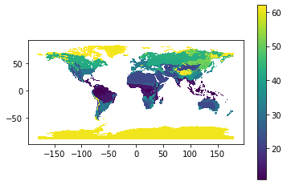
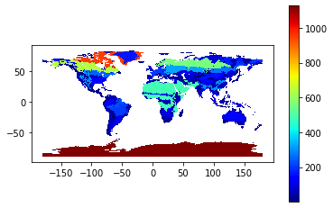
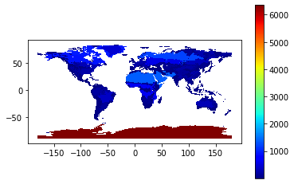
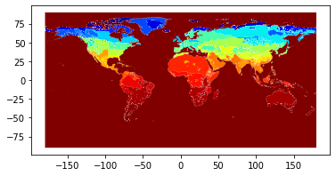
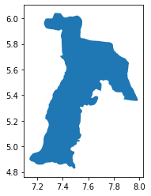
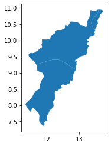

```python
from matplotlib import pyplot as plt
import geojsonio
import geopandas as gpd
from shapely.geometry import polygon
import plotly

data = gpd.read_file(r"C:\Users\NWANDU KELECHUKWU\Desktop\outreachy2\1901-1925.geojson")
data.head(20)

```


<div>
<style scoped>
    .dataframe tbody tr th:only-of-type {
        vertical-align: middle;
    }

    .dataframe tbody tr th {
        vertical-align: top;
    }

    .dataframe thead th {
        text-align: right;
    }
</style>
<table border="1" class="dataframe">
  <thead>
    <tr style="text-align: right;">
      <th></th>
      <th>OBJECTID</th>
      <th>ID</th>
      <th>GRIDCODE</th>
      <th>Shape_Length</th>
      <th>Shape_Area</th>
      <th>geometry</th>
    </tr>
  </thead>
  <tbody>
    <tr>
      <td>0</td>
      <td>1</td>
      <td>1</td>
      <td>62</td>
      <td>2.0</td>
      <td>0.25</td>
      <td>POLYGON ((-37.50000 83.50000, -37.50000 84.000...</td>
    </tr>
    <tr>
      <td>1</td>
      <td>2</td>
      <td>2</td>
      <td>62</td>
      <td>16.0</td>
      <td>3.75</td>
      <td>POLYGON ((-29.50000 83.50000, -29.50000 84.000...</td>
    </tr>
    <tr>
      <td>2</td>
      <td>3</td>
      <td>3</td>
      <td>62</td>
      <td>5.0</td>
      <td>1.00</td>
      <td>POLYGON ((-46.00000 83.00000, -44.00000 83.000...</td>
    </tr>
    <tr>
      <td>3</td>
      <td>4</td>
      <td>4</td>
      <td>62</td>
      <td>7.0</td>
      <td>1.50</td>
      <td>POLYGON ((-42.50000 83.50000, -42.50000 83.000...</td>
    </tr>
    <tr>
      <td>4</td>
      <td>5</td>
      <td>5</td>
      <td>62</td>
      <td>3.0</td>
      <td>0.50</td>
      <td>POLYGON ((-75.50000 81.00000, -75.50000 81.500...</td>
    </tr>
    <tr>
      <td>5</td>
      <td>6</td>
      <td>6</td>
      <td>62</td>
      <td>2.0</td>
      <td>0.25</td>
      <td>POLYGON ((-73.50000 81.00000, -73.50000 81.500...</td>
    </tr>
    <tr>
      <td>6</td>
      <td>7</td>
      <td>7</td>
      <td>61</td>
      <td>2.0</td>
      <td>0.25</td>
      <td>POLYGON ((55.00000 81.00000, 55.00000 81.50000...</td>
    </tr>
    <tr>
      <td>7</td>
      <td>8</td>
      <td>8</td>
      <td>61</td>
      <td>3.0</td>
      <td>0.50</td>
      <td>POLYGON ((55.50000 81.00000, 56.50000 81.00000...</td>
    </tr>
    <tr>
      <td>8</td>
      <td>9</td>
      <td>9</td>
      <td>61</td>
      <td>2.0</td>
      <td>0.25</td>
      <td>POLYGON ((58.50000 81.00000, 58.50000 81.50000...</td>
    </tr>
    <tr>
      <td>9</td>
      <td>10</td>
      <td>10</td>
      <td>61</td>
      <td>2.0</td>
      <td>0.25</td>
      <td>POLYGON ((60.50000 81.00000, 61.00000 81.00000...</td>
    </tr>
    <tr>
      <td>10</td>
      <td>11</td>
      <td>11</td>
      <td>62</td>
      <td>4.0</td>
      <td>0.75</td>
      <td>POLYGON ((91.50000 81.00000, 91.50000 81.50000...</td>
    </tr>
    <tr>
      <td>11</td>
      <td>12</td>
      <td>12</td>
      <td>61</td>
      <td>4.0</td>
      <td>0.75</td>
      <td>POLYGON ((-69.50000 80.50000, -69.50000 81.000...</td>
    </tr>
    <tr>
      <td>12</td>
      <td>13</td>
      <td>13</td>
      <td>61</td>
      <td>3.0</td>
      <td>0.50</td>
      <td>POLYGON ((26.00000 80.50000, 26.00000 80.00000...</td>
    </tr>
    <tr>
      <td>13</td>
      <td>14</td>
      <td>14</td>
      <td>62</td>
      <td>14.0</td>
      <td>5.25</td>
      <td>POLYGON ((50.50000 80.00000, 50.50000 80.50000...</td>
    </tr>
    <tr>
      <td>14</td>
      <td>15</td>
      <td>15</td>
      <td>61</td>
      <td>2.0</td>
      <td>0.25</td>
      <td>POLYGON ((53.00000 80.00000, 53.00000 80.50000...</td>
    </tr>
    <tr>
      <td>15</td>
      <td>16</td>
      <td>16</td>
      <td>62</td>
      <td>2.0</td>
      <td>0.25</td>
      <td>POLYGON ((53.00000 80.00000, 53.50000 80.00000...</td>
    </tr>
    <tr>
      <td>16</td>
      <td>17</td>
      <td>17</td>
      <td>62</td>
      <td>27.0</td>
      <td>9.50</td>
      <td>POLYGON ((60.00000 80.00000, 60.00000 80.50000...</td>
    </tr>
    <tr>
      <td>17</td>
      <td>18</td>
      <td>18</td>
      <td>61</td>
      <td>4.0</td>
      <td>0.75</td>
      <td>POLYGON ((60.00000 80.00000, 61.50000 80.00000...</td>
    </tr>
    <tr>
      <td>18</td>
      <td>19</td>
      <td>19</td>
      <td>62</td>
      <td>6.0</td>
      <td>1.75</td>
      <td>POLYGON ((-98.50000 79.50000, -98.50000 80.000...</td>
    </tr>
    <tr>
      <td>19</td>
      <td>20</td>
      <td>20</td>
      <td>61</td>
      <td>11.0</td>
      <td>3.50</td>
      <td>POLYGON ((-90.00000 79.50000, -90.00000 80.000...</td>
    </tr>
  </tbody>
</table>
</div>


```python

from matplotlib import pyplot as plt
import geojsonio
import geopandas as gpd
from shapely.geometry import polygon
import plotly

data = gpd.read_file(r"C:\Users\NWANDU KELECHUKWU\Desktop\outreachy2\1901-1925.geojson")
data.plot(column='GRIDCODE', legend = True)
plt.show()
```





```python
from matplotlib import pyplot as plt
import geojsonio
import geopandas as gpd
from shapely.geometry import polygon
import plotly

data = gpd.read_file(r"C:\Users\NWANDU KELECHUKWU\Desktop\outreachy2\1901-1925.geojson")
data.plot(cmap = 'jet', column = 'Shape_Length', legend = True)
```


    <AxesSubplot:>





```python
from matplotlib import pyplot as plt
import geojsonio
import geopandas as gpd
from shapely.geometry import polygon
import plotly

data = gpd.read_file(r"C:\Users\NWANDU KELECHUKWU\Desktop\outreachy2\1901-1925.geojson")
data.plot(cmap = 'jet', column = 'Shape_Area', legend = True)
```


    <AxesSubplot:>





```python
from matplotlib import pyplot as plt
import geojsonio
import geopandas as gpd
from shapely.geometry import polygon
import plotly

data = gpd.read_file(r"C:\Users\NWANDU KELECHUKWU\Downloads\IPCC_ClimateZoneMap_Vector.geojson")
data.head()
```


<div>
<style scoped>
    .dataframe tbody tr th:only-of-type {
        vertical-align: middle;
    }

    .dataframe tbody tr th {
        vertical-align: top;
    }

    .dataframe thead th {
        text-align: right;
    }
</style>
<table border="1" class="dataframe">
  <thead>
    <tr style="text-align: right;">
      <th></th>
      <th>CLASS_NAME</th>
      <th>geometry</th>
    </tr>
  </thead>
  <tbody>
    <tr>
      <td>0</td>
      <td>0</td>
      <td>MULTIPOLYGON (((-37.65000 83.50000, -37.65000 ...</td>
    </tr>
    <tr>
      <td>1</td>
      <td>0</td>
      <td>MULTIPOLYGON (((-38.75000 83.40000, -38.75000 ...</td>
    </tr>
    <tr>
      <td>2</td>
      <td>0</td>
      <td>MULTIPOLYGON (((-38.60000 83.40000, -38.60000 ...</td>
    </tr>
    <tr>
      <td>3</td>
      <td>0</td>
      <td>MULTIPOLYGON (((-37.15000 83.40000, -37.15000 ...</td>
    </tr>
    <tr>
      <td>4</td>
      <td>5</td>
      <td>MULTIPOLYGON (((-40.40000 83.40000, -40.40000 ...</td>
    </tr>
  </tbody>
</table>
</div>


```python
from matplotlib import pyplot as plt
import geojsonio
import geopandas as gpd
from shapely.geometry import polygon
import plotly

data = gpd.read_file(r"C:\Users\NWANDU KELECHUKWU\Downloads\IPCC_ClimateZoneMap_Vector.geojson")
data.plot(cmap = 'jet', legend = True)
```


    <AxesSubplot:>





```python
from matplotlib import pyplot as plt
import geojsonio
import geopandas as gpd
from shapely.geometry import polygon
import plotly

data = gpd.read_file(r"C:\Users\NWANDU KELECHUKWU\Desktop\outreachy2\NGA_AL4_Abia_GEZ.json")
data1 = gpd.read_file(r"C:\Users\NWANDU KELECHUKWU\Desktop\outreachy2\NGA_AL4_Adamawa_GEZ.json")
data.head()
data1.head()
```


<div>
<style scoped>
    .dataframe tbody tr th:only-of-type {
        vertical-align: middle;
    }

    .dataframe tbody tr th {
        vertical-align: top;
    }

    .dataframe thead th {
        text-align: right;
    }
</style>
<table border="1" class="dataframe">
  <thead>
    <tr style="text-align: right;">
      <th></th>
      <th>country</th>
      <th>ISO3166_2</th>
      <th>name</th>
      <th>gez_name</th>
      <th>gez_code</th>
      <th>gez_abbrev</th>
      <th>adminlevel</th>
      <th>geometry</th>
    </tr>
  </thead>
  <tbody>
    <tr>
      <td>0</td>
      <td>NGA</td>
      <td>NG-AD</td>
      <td>Adamawa</td>
      <td>Tropical dry forest</td>
      <td>13</td>
      <td>TAwb</td>
      <td>4</td>
      <td>POLYGON ((13.59259 10.94944, 13.58541 10.94946...</td>
    </tr>
    <tr>
      <td>1</td>
      <td>NGA</td>
      <td>NG-AD</td>
      <td>Adamawa</td>
      <td>Tropical moist forest</td>
      <td>12</td>
      <td>TAwa</td>
      <td>4</td>
      <td>POLYGON ((12.88795 9.10048, 12.88658 9.10126, ...</td>
    </tr>
    <tr>
      <td>2</td>
      <td>NGA</td>
      <td>NG-AD</td>
      <td>Adamawa</td>
      <td>Tropical mountain system</td>
      <td>16</td>
      <td>TM</td>
      <td>4</td>
      <td>MULTIPOLYGON (((12.00401 7.51347, 12.00703 7.5...</td>
    </tr>
  </tbody>
</table>
</div>


```python
from matplotlib import pyplot as plt
import geojsonio
import geopandas as gpd
from shapely.geometry import polygon
import plotly

data1 = gpd.read_file(r"C:\Users\NWANDU KELECHUKWU\Desktop\outreachy2\NGA_AL4_Adamawa_GEZ.json")
data = gpd.read_file(r"C:\Users\NWANDU KELECHUKWU\Desktop\outreachy2\NGA_AL4_Abia_GEZ.json")
data.plot()
data1.plot()
```


    <AxesSubplot:>








```python

```
